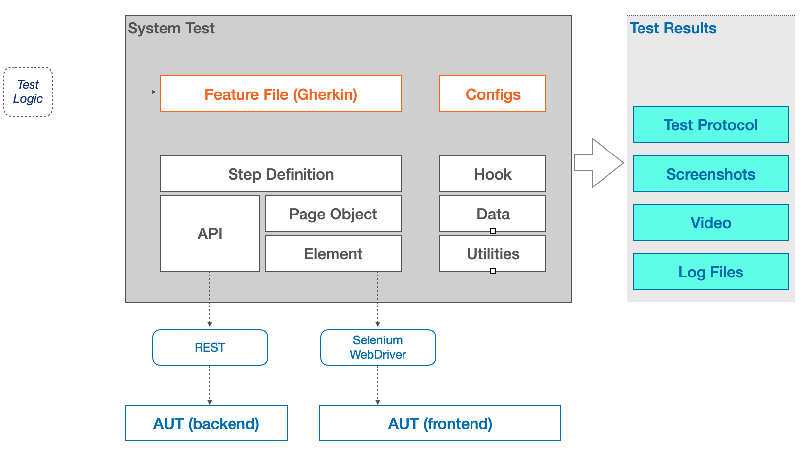

# Medusa Demo Testautomation with Selenium and Cucumber
## Introduction
This project shows how to automate tests using Selenium Webdriver in combination with Cucumber.

## How to run
### Precondition
As a precondition, this project requires an running instance of Medusa Online Shop (backend and frontend) as described in the related [documentation](https://docs.medusajs.com/).

The test client expects the Medusa application-under-test (AUT) running on 
- Frontend: localhost:8000/store
- Backend: localhost:9000/app
- REST API: localhost:9000

### Configure the test
This project was successfully tested with Chrome and Firefox.

```
# Driver Type: chrome, safari, edge, firefox
driver=chrome
#local or remote WebDriver
environment=local
# Initial url of the AUT web interface being loaded on start
AUT_URL=http://localhost:8000/store
```

### Start the test
The full test can be started using [Maven](https://maven.apache.org) by command:
> `mvn clean test`

## Structure
The hierarchy of this project is based on several layers each with specific responsibilities:


- A **Feature File** defines the behavior of the test. It includes the test configuration and flow, and the expected results. The feature is written in "customer language".
- The **Step Definitions** are responsible to translate the feature files into "programming language" and to perform the interactions with the AUT (application under test).
- A **Page** represents a real (sub-) page of the (Web-) Frontend of the AUT. It provides a programming interface being used by Step Definitions.
- The package **Elements** supports the handling of Web Elements. 
- The package **API** provides a domain specific, high level programming interface being used by Step Definitions. It uses the Rest API of the AUT (Store, Backend).  
- The package **DATA** contains a domain data model. During testing, it is used for test data creation, update and comparison with expected data. 


### Feature Files
A **Feature File** describes a tests using a descriptive language like german or english. <br>
The test is organized in one or more **Scenarios**.<br>
Each **Scenario** consist of several **Steps** describing the contained actions an checks of the test using the so called [Gherkin](https://cucumber.io/docs/gherkin/) syntax.<br>
This is an essential part of the contained [Cucumber](https://cucumber.io) framework, as it serves as an automation test script as well a living documentation of the feature. <br>

The current configuration of the cucumber framework expects the Feature Files located in <br>
`/src/test/resources/features`<br>

When running `mvn clean install`, all Feature Files (==tests) found at this location are executed.<br>

### Steps / Step Definition
The **Steps** of an Feature File are interpreted via the Step Definitions located in package `com.avenqo.medusa.fe.selenium.test.steps`.<br>

For GUI (Graphical User Interface) tests, the implementation of a Step Definition defines the actions and checks performed on a WebPage (respective Mobile Page, Dialog etc).<br>
Therefore, the Step Definition are programmed against Page Objects, but will never use the driver directly.<br>
On the other hand, business rule assertions are always done on *Steps layer*, based on the informations delivered by the *Pages*.<br>

One important aim when finding new Steps is the reusability. We want to define steps having the potential to be applied in several scenarios and feature files.<br>

Regarding Step Definitions, you may find other Best Practices [at this location](https://cucumber.io/docs/gherkin/step-organization/?lang=java). <br>

### Pages / Page Objects
A *Page* represents a Page Object as described in [Page Object pattern](https://martinfowler.com/bliki/PageObject.html).<br>
It provides a interface to control i.e. a part of a WebPage, a pop-up dialog or similar. It may also deliver informations as provided by the Page to a user.<br>
Page Objects are not allowed to contain any *business assertion*. This kind of assertion are cruical part of the *Step Defintions*.<br>
Page Objects may contain programming and consistency assertions, or may throw runtime exceptions. This will help to find and avoid programming problems at an early stage of test automation.

Usually, Pages Objects are using the *Element layer* for WebElement interactions.<br>

### Elements
The purposes of the Elements layer are ...
1. to easier any bug analysis by providing a separated logging level output
2. to establish regular explicit waits before interacting with an element
3. to provide convenience by shorting commands

For instance, it makes sense to clear an input field before sending any keys. This makes the input procedure more stable and independent from any actions done before - a typical problem when reordering tests and steps.


### REST API
t.b.d

### Data
We need to create Business Objects as input for the test cases and as a basis for subsequent result comparison.<br>
Business Objects are organized in package `com.avenqo.medusa.fe.selenium.test.datacom.avenqo.medusa.fe.selenium.test.data`.<br>

## Others
### Logging
The Logging is configured via config file `src/main/resources/logback.xml'.<br>
Logging is very important due to the fact that CI/CD environments are working headless. It is necessary to provide a way for reconstructing the commands, actions and comparisons performed during the test.<br>
To save time and effort, the logging output must be well-arranged.<br>
Therefore, steps, pages and elements have different logging appenders producing differently formated output like this:

> `STEP : 10:47:51.357 DEBUG STEP StoreFrontendSteps.[ich_gehe_mit_dem_Warenkorb_zur_kasse]` <br>
> `>>PAGE : 10:47:51.357 INFO  STEP NavigationBar.[gotoBag] ` <br>
> `....ELEMENT -- : 10:47:51.357 INFO  STEP WE.[find] - By [By.partialLinkText: My Bag]`<br>
> `>>PAGE : 10:47:51.382 INFO  STEP BasketPage.[waitUntilVisible] ` <br>
> `....ELEMENT -- : 10:47:51.382 INFO  STEP WE.[waitUntilVisible] - WebElement: By.cssSelector: a[href='/checkout']`<br>
> `>>PAGE : 10:47:52.973 INFO  STEP BasketPage.[checkout] - `<br>
> `....ELEMENT -- : 10:47:52.973 INFO  STEP WE.[click] - WebElement: By.className: content-container`<br>
> `....ELEMENT -- : 10:47:52.974 INFO  STEP WE.[waitUntilVisible] - WebElement: By.className: content-container`<br>
> `....ELEMENT -- : 10:47:52.974 INFO  STEP WE.[waitUntilVisible] - WebElement: By.className: content-container`<br>

